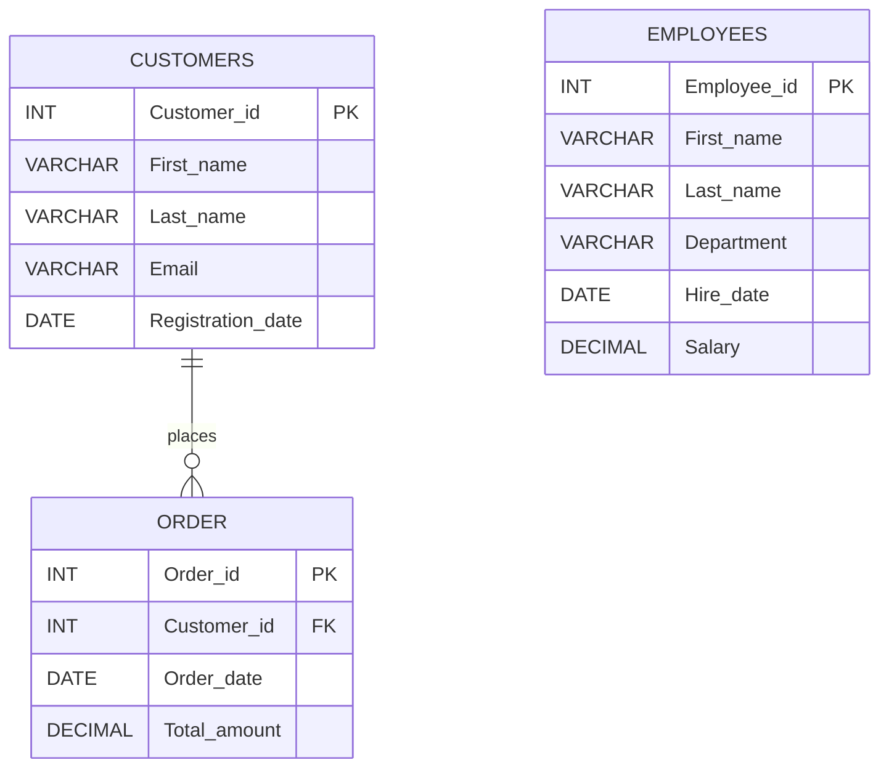

<div align="center">

# ⚡ DATA TRANSFORMER
### `Advanced SQL • Relational Algebra • Analytical Engineering`

**👨‍💻 Created & Maintained by [Dixit Maru](https://github.com/Dixit2307)**

[](https://github.com/Dixit2307)
[](https://www.mysql.com/)
[](#)
[](#)


<br/>


</div>

---

## 🧬 What is Data Transformer?

**Data Transformer (PR.2)** is an analytical SQL project engineered to model enterprise customer relationships, commerce transactions, and workforce talent pools[cite: 1].

It takes database engineering beyond standard CRUD, scaling into production-level data transformation[cite: 1]:

```text
RAW RELATIONAL TABLES
          ↓
MULTI-SET JOINS (INNER, LEFT, RIGHT, FULL OUTER)
          ↓
DYNAMIC SUBQUERY BENCHMARKING
          ↓
DATE ARITHMETIC & STRING SANITIZATION
          ↓
ANALYTIC WINDOWING (SUM OVER, RANK)
          ↓
CONDITIONAL BUSINESS LOGIC (CASE ROUTING)
          ↓
DECISION-READY BUSINESS INTELLIGENCE

```

The system initializes the `Data_transformer` database and processes three core operational domains: **Customers, Orders, and Employees**.

---

## 🖥️ Project Matrix

| Domain | Entity | Purpose | Core SQL Capabilities

 |
| --- | --- | --- | --- |
| 👤 **Identity** | `Customers` | Master account directory & registration audit | Primary Key constraints, date parsing

 |
| 🧾 **Commerce** | `Order` | Transaction records & financial volumes | `FOREIGN KEY` enforcement, running balances, rankings

 |
| 👥 **Workforce** | `Employees` | Departmental workforce & compensation index | String cleansing, salary banding, aggregate subqueries

 |

---

## 🧠 Database Architecture



Foreign keys enforce referential integrity between `Order.Customer_id` and `Customers.Customer_id`.

---

## 🧪 Query Playground & Transformation Showcase

### 🔗 01. The Join Spectrum (Relational Synthesis)

```sql
-- [Q1] INNER JOIN: Extract active transactional records
SELECT o.Order_id, o.Order_date, o.Total_amount, c.Customer_id, c.First_name, c.Last_name
FROM `Order` o
INNER JOIN Customers c ON o.Customer_id = c.Customer_id;

-- [Q4] FULL OUTER JOIN (Emulated via UNION): Comprehensive ledger sweep
SELECT c.Customer_id, c.First_name, c.Last_name, o.Order_id, o.Order_date, o.Total_amount
FROM Customers c
LEFT JOIN `Order` o ON c.Customer_id = o.Customer_id
UNION
SELECT c.Customer_id, c.First_name, c.Last_name, o.Order_id, o.Order_date, o.Total_amount
FROM Customers c
RIGHT JOIN `Order` o ON c.Customer_id = o.Customer_id;

```

---

### 🎯 02. Analytical Subqueries & Benchmarking

```sql
-- [Q5] Dynamic High-Value Customers (Purchases > Average Basket Size)
SELECT * FROM Customers
WHERE Customer_id IN (
    SELECT Customer_id FROM `Order` 
    WHERE Total_amount > (SELECT AVG(Total_amount) FROM `Order`)
);

-- [Q6] Top-Tier Talent (Salaries exceeding global average)
SELECT Employee_id, First_name, Last_name, Department, Salary
FROM Employees
WHERE Salary > (SELECT AVG(Salary) FROM Employees);

```

---

### ⏳ 03. Date Engineering & String Cleansing

```sql
-- [Q8] Real-time latency calculation (Days elapsed since order placement)
SELECT 
    Order_date,
    DATEDIFF(CURDATE(), Order_date) AS Days_difference
FROM `Order`;

-- [Q9] Enterprise Date Standardization (DD-MM-YYYY)
SELECT 
    DATE_FORMAT(Order_date, '%d-%m-%Y') AS Formatted_date
FROM `Order`;

-- [Q10 & Q12] Full name synthesis & capitalization normalization
SELECT 
    CONCAT(TRIM(First_name), ' ', TRIM(Last_name)) AS Full_name,
    UPPER(TRIM(First_name)) AS First_Upper,
    LOWER(TRIM(Last_name)) AS Last_Lower
FROM Employees;

```

---

### 📈 04. Advanced Windowing & Conditional Logic

```sql
-- [Q14 & Q15] Cumulative Financial Velocity & Dense Ranking
SELECT 
    Order_id, 
    Total_amount,
    SUM(Total_amount) OVER(ORDER BY Order_date, Order_id) AS Running_total,
    RANK() OVER(ORDER BY Total_amount DESC) AS OrderRank
FROM `Order`;

-- [Q16 & Q17] Business Logic Tiering (Case Expression Routing)
SELECT 
    Order_id,
    Total_amount,
    CASE 
        WHEN Total_amount >= 900 THEN '15% Discount'
        WHEN Total_amount >= 500 THEN '10% Discount'
        WHEN Total_amount >= 100 THEN '5% Discount'
        ELSE 'No Discount'
    END AS Discount_Tier
FROM `Order`;

```

---

## 🛰️ Transformation Data Flow

```text
                    ┌─────────────────────────┐
                    │  Data_transformer DB    │
                    └────────────┬────────────┘
                                 │
                 ┌───────────────┴───────────────┐
                 ▼                               ▼
       ┌───────────────────┐           ┌───────────────────┐
       │     Customers     │           │     Employees     │
       └─────────┬─────────┘           └─────────┬─────────┘
                 │                               │
                 ▼                               ▼
       ┌───────────────────┐           ┌───────────────────┐
       │     `Order`       │           │ String & Salary   │
       └─────────┬─────────┘           │ Categorization    │
                 │                     └─────────┬─────────┘
                 ▼                               │
       ┌───────────────────┐                     │
       │ Window Analytics  │                     │
       │ & Subquery Engine │                     │
       └─────────┬─────────┘                     │
                 │                               │
                 └───────────────┬───────────────┘
                                 │
                                 ▼
                     ┌───────────────────────┐
                     │ TRANSFORMED INSIGHTS  │
                     └───────────────────────┘

```

---

## 📈 SQL Skill Radar

```text
████████████████████  Schema Modeling & Normalization
████████████████████  Multi-Table Relational Joins
████████████████████  Window Functions (SUM OVER, RANK)
██████████████████░░  Dynamic Subqueries & Filtering
██████████████████░░  Conditional Logic (CASE / WHEN)
████████████████░░░░  Date-Time Calculations & Formats
████████████████░░░░  Scalar String Sanitization

```

> **Mission:** Don't just store transactions. **Transform them into business intelligence.**

---

## ⚙️ Tech Stack

---

## 🚀 Run the Project

### 01 — Clone the Repository

```bash
git clone [https://github.com/Dixit2307/data-transformer.git](https://github.com/Dixit2307/data-transformer.git)
cd data-transformer

```

### 02 — Initialize Database Engine

```sql
CREATE DATABASE Data_transformer;
USE Data_transformer;

```

### 03 — Execute Schema & Migrations

Run the notebook or import directly via CLI:

```bash
mysql -u root -p Data_transformer < "Data Transformer.sqlbook"

```

### 04 — Execute Query Modules

Explore the 17 production SQL scripts covering:

```text
INNER / LEFT / RIGHT / FULL OUTER JOINS
CORRELATED & UNCORRELATED SUBQUERIES
WINDOW FUNCTIONS (RUNNING SUMS, RANKINGS)
DATEDIFF() & DATE_FORMAT()
TRIM(), CONCAT(), UPPER(), LOWER()
CASE WHEN TIERING & SEGMENTATION

```

---

## 🔍 What You Master Here

```text
✓ Relational Database Modeling with Primary & Foreign Key constraints
✓ Join mechanics across 1:N cardinality (matching vs orphan handling)
✓ Emulating FULL OUTER JOIN using algebraic set unions (UNION)
✓ Multi-level nested subqueries with dynamic aggregations
✓ Window partitioned frames for running metrics without self-joins
✓ Real-world date calculations and custom date formatting
✓ Production-grade string parsing, cleaning, and concatenation
✓ Categorical business rules modeling using CASE WHEN trees

```

---

## 🧠 NextGen Challenge Mode

```text
[ LEVEL 01 ]  Create Department-wise Salary Aggregates using DENSE_RANK()
[ LEVEL 02 ]  Implement LAG() and LEAD() to analyze customer purchase intervals
[ LEVEL 03 ]  Build an automated trigger for order audit logs
[ LEVEL 04 ]  Design a View for High-Frequency / High-Spender accounts
[ LEVEL 05 ]  Index Foreign Keys and benchmark query latency
[ LEVEL 06 ]  Build a Stored Procedure for dynamic discount calculation

```

---

## 👨‍💻 Developer — Dixit Maru

> **NextGen Developer • Data Science & Analytics Specialist • SQL Engineer**
> 🐙 GitHub: **[Dixit2307](https://github.com/Dixit2307)**

---

## 🧑‍💻 Developer Terminal

```bash
$ whoami
dixit-maru

$ mission
transform_raw_records_into_intelligence

$ toolkit
MySQL • SQLBook • Relational Algebra • Analytical Engineering

$ mindset
design → normalize → query → optimize → transform

$ status
████████████████████  ONLINE & EXECUTING

```

---

### `DATA IS RAW BY NATURE.`

### `TRANSFORMATION MAKES IT POWERFUL.`

**Built with precision by [Dixit Maru](https://github.com/Dixit2307) ⚡ Queries + Structure + Performance**

[⭐ Follow Dixit2307 on GitHub](https://github.com/Dixit2307)
